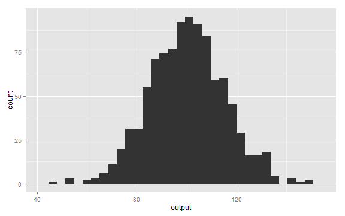
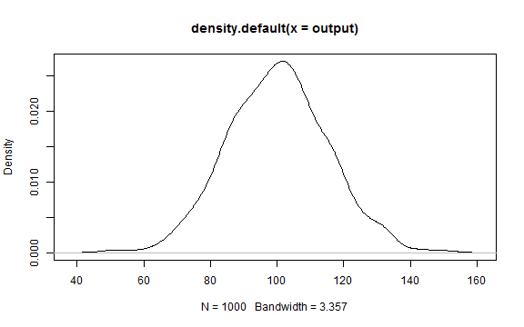

## Climate Outcomes

1. How much will CO2 emission warm the earth
$$latex
\Delta = ECS/3.7 * 5.35 * ln(CO2_new/CO2_old) 
$$
2. Depends on how much additional CO2 is emitted
3. Depends on how sensitive (ECS) the global climate is to CO2

---

## CO2 Emissions: The Known Knowns

1. ~200 PPMV already emitted since pre-industrial era.
2. Burning all proved fossil fuels would raise CO2 by about another 350 PPM.
3. Oceans absorb about 50% of emissions.
4. So total increase could be ~275 PPMV, nearly doubling pre-industrial CO2.

---

## The Known Unknowns in Fossil Fuels


```r
# MBOE -> BBOE -> BTOE -> GTCO2 -> PPMV
oil.co2.f95=253744 / 1000 / 7.3 * 3.07 / 8 
oil.co2.f05=1580342 / 1000 / 7.3 * 3.07 / 8
# BCFG -> TCMG -> BTOE -> GTCO2 -> PPMV 
gas.co2.f05=12224190 * 0.0283168 / 1000 * 0.9 * 2.35 / 8
gas.co2.f95=1950093 * 0.0283168 / 1000 * 0.9 * 2.35 / 8
gas.co2.mu=(gas.co2.f05+gas.co2.f95)/2 
gas.co2.sigma=(gas.co2.f05-gas.co2.f95)/4 
oil.co2.mu=(oil.co2.f05+oil.co2.f95)/2
oil.co2.sigma=(oil.co2.f05+oil.co2.f95)/4
# MT COAL -> BT COAL -> BTOE -> GTCO2 -> PPMV
coal.co2.mu=1800000 / 1000 / 2.25 * 3.96 / 8
coal.co2.sigma=900000 / 1000 / 2.25 * 3.96 / 8
x = 0:(coal.co2.mu+2*coal.co2.sigma) 
coalcum=pnorm(seq(1,800,by=8),coal.co2.mu,coal.co2.sigma)
gascum=pnorm(seq(1,100,by=1),gas.co2.mu,gas.co2.sigma)
oilcum=pnorm(seq(1,100,by=1),oil.co2.mu,oil.co2.sigma)
coalcum=coalcum*880
gascum=gascum*93
oilcum=oilcum*96
dfcum=data.frame(x=seq(1,100),coalcum,gascum,oilcum)
plot(dfcum$coalcum ~ dfcum$x, type='l', ylim=c(0,1000), 
    xlab="Percentage of Potential Undiscovered Fuels",ylab="CO2 Emissions in PPMV",col="red")
lines(dfcum$coalcum+dfcum$oilcum ~ dfcum$x, type='l', ylim=c(0,1000), col="green")
lines(dfcum$coalcum+dfcum$oilcum+dfcum$gascum ~ dfcum$x, type='l', ylim=c(0,1000),col="blue")
title(main="Potential CO2 releases from Undiscovered Fuel Sources",
    sub="Oil and Gas estimates from USGS; Coal Estimates from Oil and Gas Journal")
legend("topleft", legend=c("Oil","Natural Gas", "Coal"), col=c("blue","green","red"), lty=1, bty='n')
```

 

---

## Density Plot

To generate random draws from a normal distribution we use the **rnorm** function:


```r
output <- rnorm(1000, 100, 15);
```

---

## Bell Shape

The normal distribution has the typical bell shape:


```r
library(ggplot2)
qplot(output)
```

```
## stat_bin: binwidth defaulted to range/30. Use 'binwidth = x' to adjust this.
```

 

---

## Kernel density estimation

We can perform density estimation on the sample:


```r
plot(density(output))
```

 

---

## Carl Friedrich Gauß

This little guy had something to do with it


---
